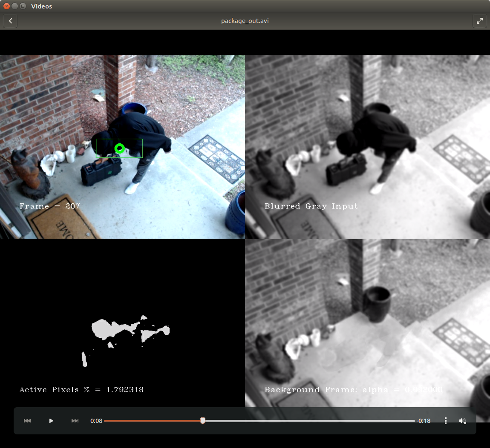

# IndependentStudySecurityCamera
This is my junoir year independent study computer science. 

Demos to view before moving on in this paper are:

1) https://drive.google.com/file/d/1uXdBhN-I-ZA9AFPpU_SLfaysUR8SFi6f/view
2) https://drive.google.com/file/d/1-IJbS520U5C_N_e8JpYvUw1GoC2ujB0c/view
3) https://drive.google.com/file/d/1gKF4m_WWakgm2c_RYL2DB02F7sedZMzG/view

Compile:

>> make

To run the program:

>> ./video_in  -s 0     //source is the default camera on a laptop

>> ./video_in  -s 1     //source is the usb camera 

>> ./video_in -f input.avi -w output.avi  //reads the input file and writes the output file  

